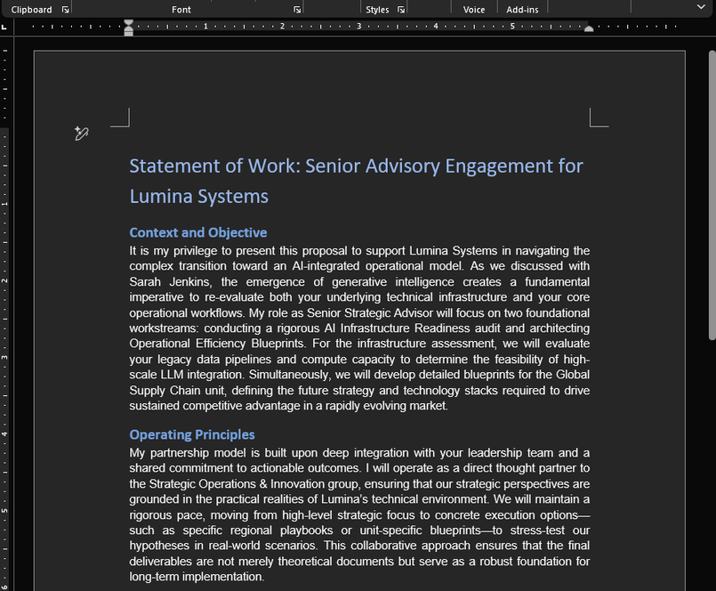
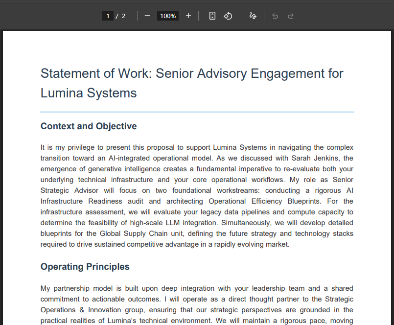

# Business Document Creation Skill


An Antigravity skill designed to automate and streamline the creation of professional business documents. It allows users to generate high-quality documents such as Proposals, Letters of Intent (LOI), and Statements of Work (SOW), which can then be exported directly into polished Word documents and PDFs.

> **⚠️ Personal Project Notice**
> This is a personal project built for my own use. You are welcome to fork it and adapt it however you like — but I will not be reviewing or merging pull requests. No hard feelings!

## Why I Built This

I was writing a proposal for a real advisory engagement and realized the process—drafting, formatting, exporting to Word and PDF—was tedious and highly repeatable. So I built an AI skill to automate it. Now, every time I need a new proposal, I write a simple context file and the agent drafts, styles, and exports a board-ready document in seconds.

I'm sharing this publicly because I think every external advisor, independent consultant, and freelancer deserves a tool like this. Fork it, swap in your own persona and fee structures, and never hand-format a proposal again.

## Overview

This project uses the Antigravity agent to draft complex business documents based on simple context files. It includes Python-based export scripts that natively convert the generated Markdown into beautifully styled, executive-ready `.docx` and `.pdf` files.

Currently supported document types:

- **Proposals / Counseling SOWs**
- Letters of Intent (LOI) _(Planned)_
- Statements of Work (SOW) _(Planned)_

## Getting Started

### Prerequisites

- Python 3.x
- [uv](https://github.com/astral-sh/uv) (Python package manager)

### Installation

Clone the repository and install the necessary dependencies using `uv`:

```powershell
uv sync
```

_(Alternatively, you can manually add the dependencies if needed: `uv add python-docx markdown xhtml2pdf`)_

## Usage

1. **Provide Context**: Create a dedicated local directory for your documents (e.g., `work_products/`) and ensure it is added to your `.gitignore`. Add a context file outlining your engagement (e.g., `my_client_context.md`).
2. **Generate the Document**: Ask your Antigravity agent to draft the document using the specific skill instructions (e.g., "Use `skills/proposal/proposal_writer.md` to write a proposal based on `work_products/my_client_context.md`").
3. **Export**: Once the markdown document is saved, the agent will automatically run (or you can manually run) the export scripts to generate Word and PDF versions:

```powershell
uv run python skills/scripts/export_docx.py work_products/my_client_proposal.md work_products/my_client_proposal.docx
uv run python skills/scripts/export_pdf.py work_products/my_client_proposal.md work_products/my_client_proposal.pdf
```

### Examples

Check the `examples/` directory for a complete demonstration, including a sample context file, the generated markdown proposal, and the final exported `.docx` and `.pdf` formats.

**Document Previews:**

| DOCX Output | PDF Output |
| :---: | :---: |
|  |  |

## Documentation

- [Product Specification](docs/PRODUCT_SPEC.md)
- [System Design](docs/SYSTEM_DESIGN.md)
- [Roadmap](docs/ROADMAP.md)
- [Documentation Index](docs/DOC_INDEX.md)
